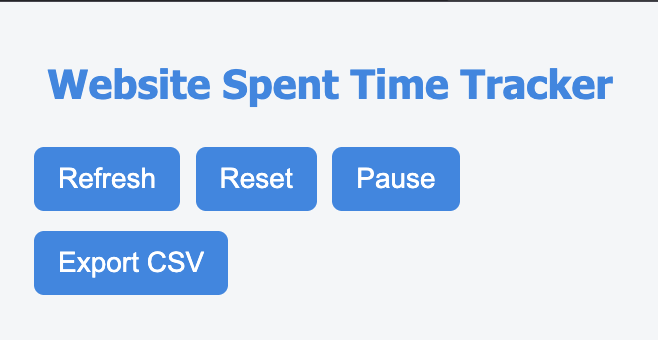
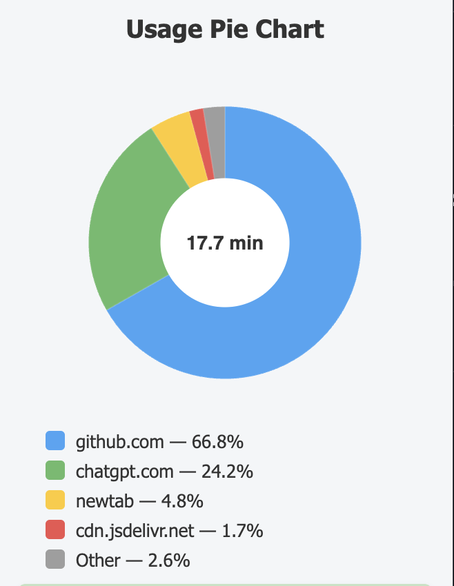
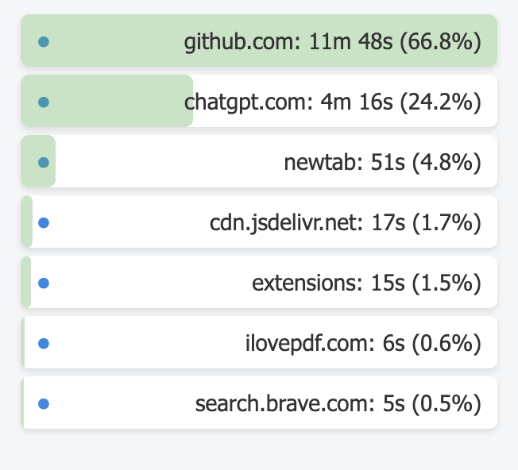

# 🌐 Website Activity Tracker Extension

A simple browser extension that tracks **how much time you spend on different websites**.  
It also provides a **pie chart visualization** of your top 4 most visited websites + "Other", and lets you **export the data to CSV** (both manually and automatically every day).

---

## 🚀 Features
- ⏱ Track time spent on each website (in minutes).
- 📊 Visualize usage with a **Pie Chart** (Top 4 + Other).
- 📥 Export data:
  - Manual **CSV download** with one click.
  - Automatic **daily CSV export** at midnight.
- 🎨 Clean and modern popup design.

---

## 📸 Screenshots

<p align="center">
  
  
  
</p>

---

## 🛠️ Technology Used
- **JavaScript (Manifest V3)** for extension logic.  
- **HTML & CSS** for popup UI.  
- **Chart.js** for pie chart visualization.  
- **Chrome/Brave APIs** for tab and storage management.  

---

## 📦 Installation Guide (Unpacked Extension)
1. Download the repository or Clone the repository
2. Extract the files to a folder on your computer.  
3. Open your browser (Chrome/Brave).  
4. Go to:  brave://extensions/(or chrome://extensions/ in Chrome)
5. Enable **Developer Mode** (toggle in the top-right).  
6. Click **Load Unpacked** → select the extracted folder.  
7. The extension is now installed and running ✅.

---

## 📥 Download
- **Latest Release (ZIP)** → [Download Here](https://github.com/mohd-ksr/web-time-tracker/archive/refs/tags/v1.0.zip)
- Or clone the repo:
```bash

git clone https://github.com/mohd-ksr/web-time-tracker

```
## 🤝 Contributing
This project is currently made for personal use, but feel free to fork and improve it.
Pull requests are welcome 🚀.

---

## 📜 License
This project is licensed under the MIT License – free to use and modify.

---

## Don't Forgot to give a star ⭐
